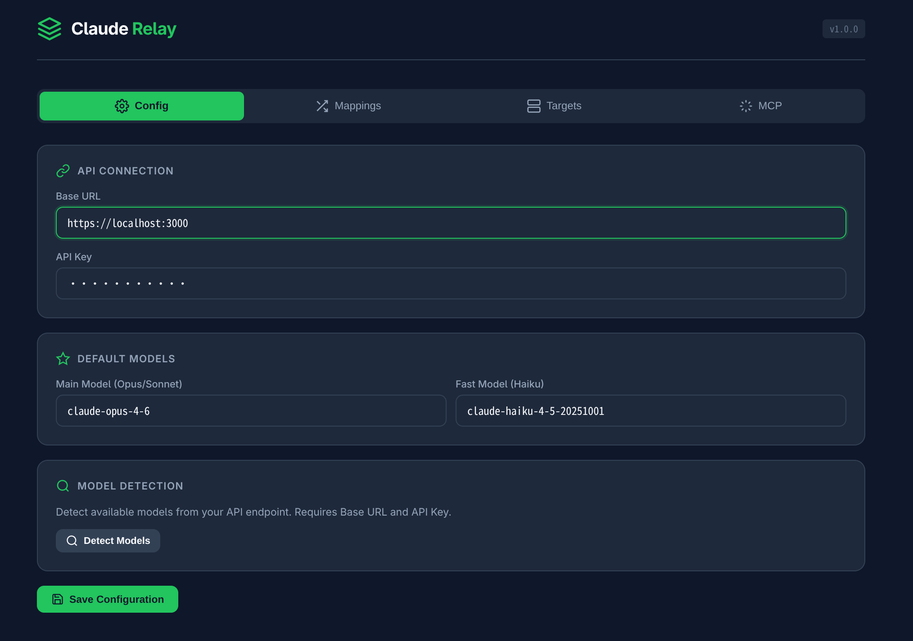
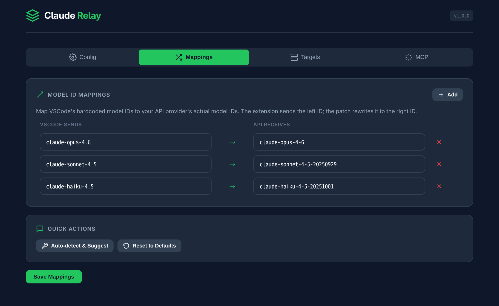
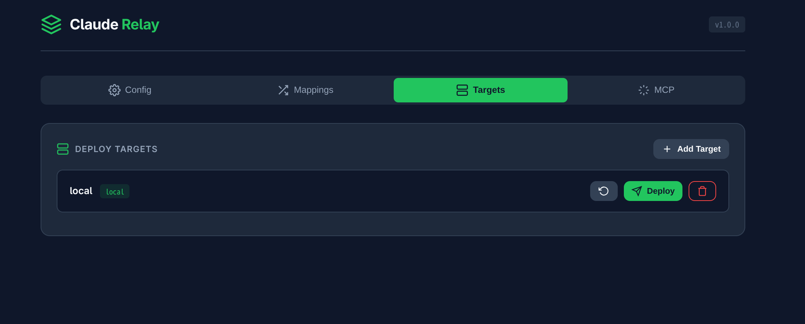
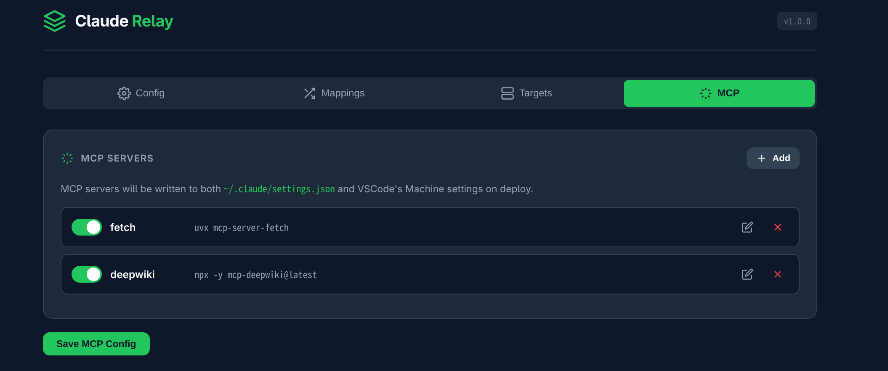

# Claude Relay

[](https://opensource.org/licenses/MIT)
[](https://golang.org)
[](#)

一个轻量级工具，让你在 VSCode 的 Claude Agent 中使用第三方 API 提供商。

## 解决的问题

VSCode Copilot Chat 插件集成了 Claude SDK，但将模型 ID 写死了。当使用第三方 base URL 时，模型 ID 不匹配导致请求失败。Claude Relay 通过以下方式解决：

1. **extension.js 补丁** — 在 VS Code 扩展宿主中注入 `JSON.stringify` 拦截，重写 UI 面板发送的模型 ID
2. **cli.js 补丁** — 在 Claude Agent SDK 进程中注入 `globalThis.__cliMap()` 模型映射，重写实际 API 请求中的模型 ID
3. **配置管理** — 自动写入 `~/.claude/settings.json` 和 VSCode Machine settings
4. **多目标部署** — 支持本地、SSH 远程、GitHub Codespaces 一键部署

> ⚠️ **关键发现**：VS Code 的 Claude Agent 模式有**两个独立进程**：`extension.js`（UI 面板）和 `cli.js`（实际 API 调用）。**只补丁 extension.js 是不够的**——cli.js 才是真正发出 HTTP 请求的文件。详见 [ARCHITECTURE.md](ARCHITECTURE.md)。

## 快速开始

```bash
# 构建
make build

# 运行（自动打开浏览器）
./claude-relay

# 或指定地址
./claude-relay -addr 0.0.0.0:9090

# 不自动打开浏览器
./claude-relay --no-browser
```

访问 `http://127.0.0.1:8787` 进入 Web UI。

## 使用流程

1. **Config** — 填入你的第三方 API Base URL 和 Key
2. **Mappings** — 配置模型 ID 映射（VSCode ID → 你的 API ID）
3. **Targets** — 添加部署目标（本地 / SSH / Codespace）
4. **Deploy** — 一键部署，自动完成 patch + 配置写入
5. **MCP** — 可选配置 MCP servers（fetch、deepwiki 等）

## 架构

```
claude-relay/
├── main.go                      # 入口
├── frontend/
│   ├── embed.go                 # Go embed 嵌入前端
│   ├── index.html               # Alpine.js SPA
│   └── static/alpine.min.js
├── internal/
│   ├── config/config.go         # 配置读写 (~/.claude-relay/config.json)
│   ├── models/models.go         # 数据结构定义
│   ├── relay/relay.go           # API 模型检测 & 建议
│   ├── server/
│   │   ├── server.go            # HTTP 路由
│   │   └── handlers.go          # API handlers
│   └── deployer/
│       ├── deployer.go          # 部署流程编排
│       ├── patcher.go           # extension.js 补丁（UI 面板）
│       ├── cli_patcher.go       # cli.js 补丁（Agent API 调用）⚡
│       ├── remote.go            # SSH/Codespace 远程操作
│       └── settings.go          # settings.json 生成
├── ARCHITECTURE.md              # 架构深度分析 & 踩坑记录
└── Makefile
```

## 补丁原理

### extension.js（UI 面板）

在 `extension.js` 末尾注入一段 JS，通过 monkey-patch `JSON.stringify` 实现模型 ID 替换：

```javascript
;(function(){
  var m = {"claude-opus-4.6":"claude-opus-4-6", ...};
  var _s = JSON.stringify;
  JSON.stringify = function(o) {
    if (o && o.model && m[o.model]) o.model = m[o.model];
    return _s.apply(this, arguments);
  };
})();
```

### cli.js（Agent API 调用）⚡ 关键

cli.js 是 Claude Agent SDK 的入口，作为独立 Node.js 进程运行，**真正发出 API 请求**。

补丁方式与 extension.js 完全不同：

```javascript
// 1. 在文件头部（import 之前）注入全局模型映射
globalThis.__cliModelMap = {"claude-opus-4.6":"claude-opus-4-6-20260205", ...};
globalThis.__cliMap = function(m) { return globalThis.__cliModelMap[m] || m; };

// 2. 在关键函数入口处调用 __cliMap() 映射模型名
// - 主对话流式生成器：B.model = globalThis.__cliMap(B.model)
// - ANSI 清理函数：return globalThis.__cliMap(A.replace(...))
// - Anthropic 客户端工厂：B = globalThis.__cliMap(B || "")
```

**为什么 cli.js 不能用 extension.js 的方式？**
- cli.js 是 ES Module（`import` 语法），不是 CommonJS
- `"use strict"` 出现在 `Function()` 构造器字符串里，不是文件顶层
- `var` 声明在错误作用域会导致 "XXX is not defined" 错误
- 必须用 `globalThis.*` 才能跨作用域访问

详见 [ARCHITECTURE.md](ARCHITECTURE.md)。

## 交叉编译

```bash
make cross
# 产出在 dist/ 目录
```

## 配置文件

- **应用配置**: `~/.claude-relay/config.json`
- **Claude 设置**: `~/.claude/settings.json`（部署时生成）
- **VSCode 设置**: 部署时自动写入 Machine settings

## 预览

### 主页面 - URL 配置


### 映射区 - 模型 ID 映射


### 目标管理 - 部署目标


### MCP 管理 - MCP Servers 配置


## 更新日志

### v1.1

- **修复 CLI 重复部署失败** — 二次部署时从干净备份恢复 `cli.js`，避免函数级 patch 残留导致签名匹配失败
- **修复 API Key 掩码回写** — 引入精确掩码检测与哨兵值，防止截断的掩码 key 被误存为真实 key

## License

MIT
